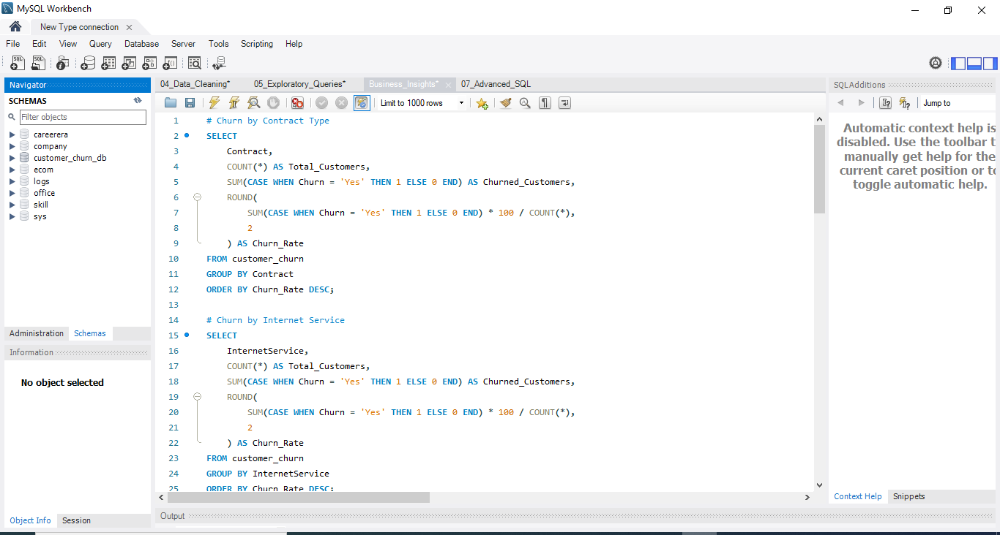

# Customer Churn Analysis

## Project Overview

Customer churn is one of the biggest challenges faced by telecom companies. This project analyzes customer behavior, identifies churn drivers, and provides actionable business recommendations using SQL, Python, and Power BI.

---

## Tools Used

- SQL (MySQL)
- Python
  - Pandas
  - NumPy
  - Matplotlib
- Power BI

---

## Dataset

Telco Customer Churn Dataset

- 7,043 customers
- 21 business features
- Target variable: Churn

---

# Project Workflow

### 1. SQL Data Analysis

Performed exploratory SQL analysis including:

- Total customers
- Churn rate
- Customer segmentation
- Contract analysis
- Internet service analysis
- Revenue loss
- Payment method analysis

### SQL Analysis



---

### 2. Python Analysis

Performed:

- Data Cleaning
- Missing value handling
- Data type conversion
- Exploratory Data Analysis
- Customer segmentation
- Business insights

---

### 3. Power BI Dashboard

Developed an interactive dashboard featuring:

- KPI Cards
- Churn Rate
- Revenue Lost
- Contract Analysis
- Internet Service Analysis
- Payment Method Analysis
- Gender Analysis
- Senior Citizen Analysis
- Interactive Filters

### Dashboard


---

### Executive Insights

Designed an executive summary page highlighting:

- Key Findings
- High-Risk Customer Profile
- Top Churn Drivers
- Revenue Loss
- Retention Strategies
- Business Recommendations


---

# Key Business Findings

- Overall Churn Rate: **26.54%**
- Revenue Lost: **$2.86M**
- Month-to-month customers have the highest churn (42.71%).
- Fiber optic customers churn significantly more than DSL customers.
- Customers paying through Electronic Check show the highest churn.
- Customers with tenure below 12 months are the highest-risk segment.
- Lack of Online Security and Tech Support strongly correlates with churn.

---

# Business Recommendations

- Encourage annual contracts through discounts.
- Improve Fiber Optic service quality.
- Promote Online Security and Tech Support bundles.
- Encourage automatic payment methods.
- Launch targeted retention campaigns during the first year of customer tenure.

---

# Repository Structure

```
Customer-Churn-Analysis
│
├── Dataset
├── SQL
├── Python
├── Power BI
└── README.md
```

---

# Author

Robin Raina

Aspiring Data Analyst

Skills:
- SQL
- Python
- Power BI
- Excel
- Data Visualization